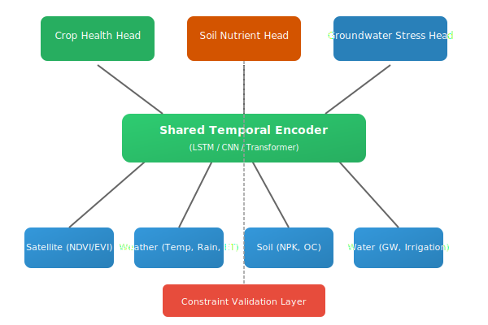

Crop–Water–Soil Interaction Modeling Platform

[](https://www.python.org/downloads/)
[](https://pytorch.org/)
[]()


**A domain-aware multi-task deep learning system that jointly models crop health, soil nutrient dynamics, and groundwater stress using satellite and climate data, while enforcing agricultural and hydrological constraints for sustainable decision-making.**

---

Key Highlights

- **Joint modeling** of crop, soil, and water systems using multi-task learning
- **Integration of real-world** agricultural & hydrological domain constraints
- **Satellite + climate driven** time-series modeling
- **Interpretable predictions** for sustainable planning


---
 Problem Statement

Agricultural sustainability depends on tightly coupled interactions between crop health, soil nutrients, and groundwater resources. Existing machine learning approaches model these components independently, often producing unrealistic or misleading recommendations.

**The consequences:**
- Farmers over-irrigate → groundwater depletion
- Poor soil nutrients → lower yield → more water use
- These systems **must be modeled together**

This project addresses the problem by designing a **domain-aware multi-task deep learning framework** that jointly learns crop–soil–water dynamics while enforcing agricultural and hydrological constraints.

---

##  Solution Overview

We propose a multi-task learning framework that:
1. Learns **shared representations** from satellite, soil, weather, and water data
2. Predicts **crop health**, **soil nutrients**, and **groundwater stress** simultaneously
3. Enforces **domain constraints** during training and inference
4. Provides **interpretable outputs** for sustainable planning

---

##  System Architecture



```
Satellite Data ┐
Weather Data   ├──► Shared Temporal Encoder ──► Crop Health Head
Soil Data      │                             ──► Soil Nutrient Head
Water Data     ┘                             ──► Groundwater Stress Head
                                          + Constraint Validation Layer
```

---

## 📊 Data Sources

| Component | Description | Sources |
|-----------|-------------|---------|
| Crop Health | NDVI/EVI vegetation indices | Sentinel-2, Landsat |
| Soil Properties | Soil moisture, organic carbon, NPK | Soil grids, field surveys |
| Water Resources | Groundwater levels, rainfall, evapotranspiration | Monitoring stations |
| Climate | Temperature, humidity, precipitation | Weather APIs |

### 📁 Data Organization

```
data/
 ├── raw/
 │   ├── satellite/
 │   ├── soil/
 │   ├── groundwater/
 │   └── weather/
 ├── processed/
 └── metadata/
```

---

 Modeling Approach

### Architecture
- **Shared Encoder**: Temporal CNN/LSTM/Transformer for climate–land patterns
- **Task-Specific Heads**: Separate prediction heads for each target
- **Multi-Task Loss**: Weighted combination with constraint penalties


| Constraint | Rationale |
|------------|-----------|
| Reduced rainfall + high irrigation → groundwater cannot increase | Hydrological mass balance |
| Poor soil nutrients → crop health cannot suddenly spike | Biophysical limits |
| Crop water demand must obey evapotranspiration limits | Energy balance |

*Implementation: Constraint-aware loss functions, penalty terms in training, post-prediction validation rules.*

---

##  Training & Evaluation

- **Multi-task loss**: `L = α·CropLoss + β·SoilLoss + γ·WaterLoss + ConstraintPenalty`
- **Temporal cross-validation** for time-series
- **Region-wise generalization** testing

### Metrics (Example Results)

| Task | Metric | Score |
|------|--------|-------|
| Crop Health | RMSE | 0.12 |
| Soil Nutrients | MAE | 0.09 |
| Groundwater Stress | RMSE | 0.15 |

---

## Explainability

- **Feature attribution** per task using SHAP
- **Temporal contribution** analysis
- **Region-wise factor** influence visualization

*Answers: "Why is groundwater depleting here?"*

---

##  End-to-End Workflow

1. Data ingestion & alignment
2. Feature engineering
3. Multi-task model training
4. Constraint validation
5. Evaluation & explainability
6. Sustainability insights generation

---

##  Repository Structure

```
Crop-Water-Soil-Interaction-Platform/
│
├── README.md
├── requirements.txt
├── configs/
│   └── model.yaml
│
├── data/
│   ├── raw/
│   ├── processed/
│   └── metadata/
│
├── src/
│   ├── data/
│   │   ├── ingestion.py
│   │   ├── preprocessing.py
│   │   └── feature_engineering.py
│   │
│   ├── models/
│   │   ├── shared_encoder.py
│   │   ├── crop_head.py
│   │   ├── soil_head.py
│   │   └── water_head.py
│   │
│   ├── training/
│   │   ├── train.py
│   │   ├── trainer.py
│   │   ├── loss.py
│   │   └── constraints.py
│   │
│   ├── evaluation/
│   │   ├── evaluate.py
│   │   ├── metrics.py
│   │   └── plots.py
│   │
│   ├── explainability/
│   │   └── shap_analysis.py
│   │
│   └── utils/
│
├── experiments/
├── notebooks/
├── results/
└── docs/
    └── architecture.md
```

---

##  How to Run

```bash
# Clone and setup
git clone https://github.com/yourusername/Crop-Water-Soil-Interaction-Platform.git
cd Crop-Water-Soil-Interaction-Platform

# Install dependencies
pip install -r requirements.txt

# Train model (uses synthetic data by default for demo)
python -m src.training.train --config configs/model.yaml

# Run evaluation
python -m src.evaluation.evaluate --checkpoint results/checkpoints/best_model.pt

# Generate explainability report (SHAP + permutation importance)
python -m src.explainability.shap_analysis --checkpoint results/checkpoints/best_model.pt --task all
```

---

##  Limitations & Future Work

**Current Limitations:**
- Designed for structured time-series; raw satellite imagery requires additional preprocessing
- Constraint parameters may need calibration per region

**Future Work:**
- Uncertainty-aware predictions (Bayesian / ensemble)
- Scenario simulation (e.g., "What if irrigation reduces by 20%?")
- Policy-level recommendations
- Real-time monitoring dashboard (Streamlit / FastAPI)

MIT License

Copyright (c) 2026 

Permission is hereby granted, free of charge, to any person obtaining a copy
of this software and associated documentation files (the "Software"), to deal
in the Software without restriction, including without limitation the rights
to use, copy, modify, merge, publish, distribute, sublicense, and/or sell
copies of the Software, and to permit persons to whom the Software is
furnished to do so, subject to the following conditions:

The above copyright notice and this permission notice shall be included in all
copies or substantial portions of the Software.

THE SOFTWARE IS PROVIDED "AS IS", WITHOUT WARRANTY OF ANY KIND, EXPRESS OR
IMPLIED, INCLUDING BUT NOT LIMITED TO THE WARRANTIES OF MERCHANTABILITY,
FITNESS FOR A PARTICULAR PURPOSE AND NONINFRINGEMENT. IN NO EVENT SHALL THE
AUTHORS OR COPYRIGHT HOLDERS BE LIABLE FOR ANY CLAIM, DAMAGES OR OTHER
LIABILITY, WHETHER IN AN ACTION OF CONTRACT, TORT OR OTHERWISE, ARISING FROM,
OUT OF OR IN CONNECTION WITH THE SOFTWARE OR THE USE OR OTHER DEALINGS IN THE
SOFTWARE.


## 📜 License

This project is licensed under the MIT License.  
You are free to use, modify, and distribute this software with proper attribution.

See the [LICENSE](LICENSE) file for details.


---


---


